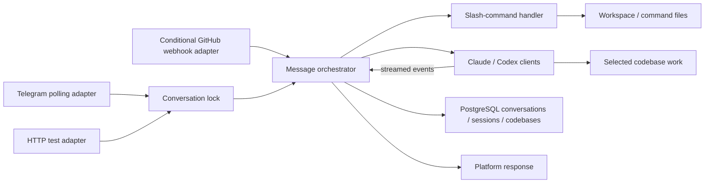

# Coding-agent fork runtime

As-is source baseline: `b4087a7ac975192c9548eb1a499c4b9274868de1`. Reviewed on 2026-09-17. This describes repository implementation, not verified live deployment state.

This is the upstream-style fork, separate from production jarvis-agent. The current entrypoint initializes Telegram, a test adapter and conditionally GitHub; README descriptions of broader integrations are not substituted for that wiring.

## Current architecture and data flow

Incoming messages resolve conversation/codebase context. Telegram and HTTP test input use the entrypoint conversation lock; the GitHub adapter invokes the orchestrator directly. Deterministic slash commands and assistant prompts follow separate paths; assistant events return through the adapter. Session identifiers persist in PostgreSQL so eligible turns can resume. This fork does not own Jarvis production deployment.

## Source evidence

- [src/index.ts](../../src/index.ts)
- [src/adapters/github.ts](../../src/adapters/github.ts)
- [src/orchestrator/orchestrator.ts](../../src/orchestrator/orchestrator.ts)
- [src/handlers/command-handler.ts](../../src/handlers/command-handler.ts)
- [src/utils/conversation-lock.ts](../../src/utils/conversation-lock.ts)
- [src/clients/claude.ts](../../src/clients/claude.ts)
- [src/clients/codex.ts](../../src/clients/codex.ts)
- [migrations/001_initial_schema.sql](../../migrations/001_initial_schema.sql)

## Change planning and maintenance

Before planning, read this map and the [project guide](../PROJECT.md), then inspect the linked implementation. For a significant change, add an explicitly labeled **to-be proposal** under this directory or in the design document, link it here, and show the affected boundaries and data flow. Keep proposed behavior separate from this as-is map. Update the current map, source links and review baseline in the same change that implements the behavior; retire or reconcile the proposal after implementation.

The [documentation deployment workflow](../deployment-documentation.md) defines the repository checks and reporting boundary. A structural check can identify missing or changed documentation, but cannot establish that a diagram matches runtime behavior. Human/code review must verify arrows, ownership, persistence and external dependencies.

Diagram maintenance uses `.nexus/diagrams.json` and `scripts/check-diagrams.py`. After reviewing the staged source changes against this map, update the source fingerprint with the shared checker and stage the metadata. The fingerprint records a review boundary, not semantic proof. Nexus tracks source changes and can open refresh PRs through the development/review workflow; updates remain reviewable PR changes, not assumed automatic merges.
